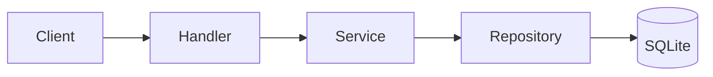

# visa-txn — project documentation

This document is a concise overview of **visa-txn** for code review: purpose, architecture, domain rules, persistence, API behaviour, configuration, and testing. For run commands and `curl` examples, see [README.md](README.md).

## Purpose

**visa-txn** is a small HTTP service in Go that models **accounts** (identified by a unique `document_number`) and **card-like transactions** (amount, operation type, event time). Data is stored in **SQLite**. The server applies the schema on startup from embedded SQL and exposes a JSON REST API.

## Scope

- Create and fetch accounts by numeric `account_id`.
- Create transactions linked to an existing account, with optional **idempotency** via the `X-Idempotency-Key` header.
- Persist transactions and an **audit** row (request/response payload snapshots) inside a single database transaction.
- Map domain errors to HTTP status codes (400, 404, 409, 500 as appropriate).

Out of scope for this codebase (called out in code where relevant): **distributed locking** around idempotency checks; a single SQLite instance does not coordinate across multiple processes.

## High-level architecture

The codebase follows a layered layout:

| Layer | Role |
|-------|------|
| `cmd/server` | Process entry: open DB, run migrations string, wire dependencies, register HTTP routes. |
| `internal/handler` | HTTP decoding/encoding, validation via DTOs, map errors to status codes. |
| `internal/service` | Business rules: operation types, amount sign (debit vs credit), idempotency policy, orchestration of repositories inside `RunInTransaction`. |
| `internal/repository` | `database/sql` access: queries and transactions; interfaces are mocked in tests. |
| `internal/model` | Domain structs. |
| `internal/dto` | Request/response shapes and validation for the HTTP API. |
| `internal/config` | Environment-backed settings and in-code **operation type** catalogue (IDs 1–4 and debit/credit sign). |
| `migrations` | Embedded `000001_init.sql` applied at startup. |

A typical **create transaction** path: handler parses JSON and idempotency header → service validates operation type and checks idempotency key → if new, verifies account exists → within one SQL transaction inserts the transaction row and the audit row → handler returns **201 Created** with the transaction body.

## Domain concepts

### Accounts

- Each account has an auto-increment **`account_id`** and a unique **`document_number`**.
- Duplicate `document_number` on create yields **409 Conflict** (`account already exists`).

### Operation types

Operation types **1–4** are defined in `internal/config`:

- **1–3**: debit-like; stored **amount** is negative (API still sends a **positive** amount).
- **4**: credit-like; stored amount stays **positive**.

Unknown `operation_type_id` yields **400** (`invalid operation type`).

### Transactions and idempotency

- Each stored transaction has a unique **`idempotency_key`** (from `X-Idempotency-Key`, or a server-generated UUID if the header is omitted).
- If a row already exists for that key, a subsequent create attempt returns **409 Conflict** (`transaction already exists`). The API does **not** return the existing row in that case.
- **Note:** concurrent requests with the same key against multiple app instances are not serialised without a distributed lock (see TODO in `TransactionService`).

### Audit

On successful insert, an audit record captures serialised request and response metadata for the idempotency key, written in the **same** SQL transaction as the transaction insert.

## Data model (SQLite)

Tables (see `migrations/000001_init.sql`):

- **`accounts`**: `account_id`, unique `document_number`, `created_at`.
- **`transactions`**: links to `accounts`, `operation_type_id`, signed `amount`, `event_date`, unique `idempotency_key`.
- **`transaction_audit`**: idempotency-scoped audit trail with request/response text and status.

Foreign keys reference `accounts(account_id)`; SQLite foreign keys are enabled via `PRAGMA foreign_keys = ON` when opening the DB.

## HTTP API summary

| Method | Path | Success | Notes |
|--------|------|---------|--------|
| `POST` | `/accounts` | **201** | Body: `document_number`. |
| `GET` | `/accounts/{id}` | **200** | `id` is `account_id`. |
| `POST` | `/transactions` | **201** | Optional `X-Idempotency-Key`. |

Errors use JSON `{"error":"<message>"}`. Representative mappings:

- **400**: validation failure, invalid operation type, invalid account id path.
- **404**: account not found (or “does not exist” for transaction create when account missing).
- **409**: duplicate account document number; duplicate idempotency key when a transaction already exists.
- **500**: internal failures (wrapped as generic internal error where applicable).

## Configuration

| Variable | Default | Meaning |
|----------|---------|---------|
| `PORT` | `8080` | Listen port. |
| `DB_URL` | `storage/visa.db` | SQLite DSN/path. |

Configuration is read with `os.Getenv` only; there is no built-in `.env` loader (see `.env.example` in the repo for documentation).

## Testing

- **Unit tests** live under `internal/service` (and similar). Repository interfaces are implemented with **mockery**-generated mocks (`make mockery`, config in `.mockery.yml`).
- Service tests that execute **`RunInTransaction`** use an in-memory SQLite handle so `Begin`/`Commit` succeed while SQL access remains mocked.
- Run the suite with `make test` or `go test ./...`.

## Tooling

| Command | Use |
|---------|-----|
| `make build` / `make run` | Local binary build and run. |
| `make test` | Tests. |
| `make mockery` | Regenerate repository mocks. |
| `make docker-build` / `make docker-run` | Container image and detached run. |

## References

- [README.md](README.md) — quick start, environment variables, `curl` examples, Makefile targets.
- [go.mod](go.mod) — Go version and module dependencies.
